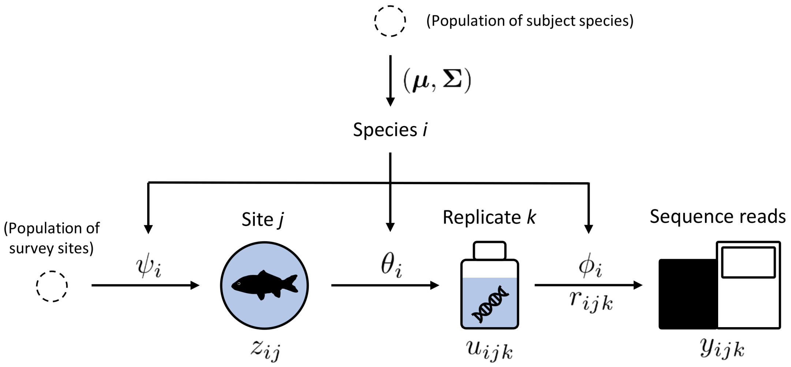

```{r, include = FALSE}
knitr::opts_chunk$set(
  collapse = TRUE,
  comment = "#>"
)
```

```{r, echo = FALSE, message = FALSE}
library(occumb)
```

The `occumb()` function implements a hierarchical model that represents the sequence read count data obtained from spatially replicated environmental DNA metabarcoding as a consequence of sequential stochastic processes (i.e., ecological and observational processes).
This model allows us to account for false-negative species detection errors that occur at different stages of the metabarcoding workflow under several assumptions, including the absence of false positive errors.
To identify the model parameters, replicates at different levels are required; that is, you should have multiple sites and multiple within-site replicates. However, it is not necessary to have a balanced design with the same number of replicates at all sites.
A brief and less formal description of this model is provided below.
Readers are encouraged to refer to the [original paper](https://doi.org/10.1111/2041-210X.13732) for a more formal and complete explanation.

# Modeling the sequential sampling process of eDNA metabarcoding

We assumed that the occurrence of `I` focal species was monitored at `J` sites sampled from an area of interest. At site `j`, `K[j]` replicates of environmental samples were collected. For each replicate, a library was prepared for DNA sequencing to obtain separate sequence reads. We denote the resulting sequence read counts of species `i` for replicate `k` at site `j` obtained using high-throughput sequencing and subsequent bioinformatics processing as `y[i, j, k]`. 



The figure above shows a diagram of the minimal model that can be fitted using `occumb()` with default settings.
The process of generating `y` is represented by a series of latent variables `z`, `u`, and `r`, and the parameters `psi`, `theta`, and `phi` that govern the variation of the latent variables. 
Although `psi`, `theta`, and `phi` are assumed to have species-specific values, modeling these parameters as functions of covariates allows for further variation (see the following section).


The right-pointing arrow on the left represents the ecological process of species distribution.
For the DNA sequence of a species to be detected at a site, the site must be occupied by that species (i.e., the eDNA of the species must be present at the site).
In this model, the site occupancy of a species is indicated by the latent variable `z[i, j]`.
If site `j` is occupied by species `i`, `z[i, j] = 1`; otherwise, `z[i, j] = 0`.
`psi[i]` represents the probability that species `i` occupies a site selected from the region of interest.
Therefore, species with high `psi[i]` values should occur at many sites in the region, whereas those with low `psi[i]` values should occur at only a limited number of sites.


Next, we focus on the second right-pointing arrow from the left, which represents one of the two observation processes: the capture of the species DNA sequence.
For the DNA sequence of a species to be detected, the environmental sample collected at an occupied site (i.e., `z[i, j] = 1`) must contain species eDNA and the amplicon derived from it must be present in the prepared sequencing library.
In this model, the inclusion of the DNA sequence of a species in a sequencing library is indicated by latent variable `u[i, j, k]`.
If the library of replicate `k` at site `j` contains the DNA sequence of species `i`, `u[i, j, k] = 1`; otherwise, `u[i, j, k] = 0`.
`theta[i]` represents the probability that the DNA sequence of species `i` is captured per replicate collected at a site occupied by the species.
The DNA sequences of species with high `theta[i]` values are more reliably captured at occupied sites, whereas those of species with low `theta[i]` values are more difficult to capture.
Note that `u[i, j, k]` is always zero for sites not occupied by a species (i.e., `z[i, j] = 0`), assuming that false positives do not occur.

Finally, we examine the right-pointing arrow on the right-hand side.
This model part represents another observation process, that is, the allocation of species sequence reads in high-throughput sequencing.
The sequence read count vector `y[1:I, j, k]` is assumed to follow a multinomial distribution, with the total number of sequence reads in replicate `k` of site `j` as the number of trials.
Its multinomial cell probability, `pi[1:I, j, k]` (not shown in the figure), is modeled as a function of the latent variables `u[1:I, j, k]` described above and `r[1:I, j, k]`, which is proportional to the relative frequency of the species sequence reads.
The variation in `r[i, j, k]` is governed by parameter `phi[i]`, which represents the relative dominance of a species sequence.
Species with higher `phi[i]` values tend to have more reads when the species sequence was included in the library (`u[i, j, k] = 1`), whereas species with lower `phi[i]` values tend to have fewer reads.
No false positives are assumed to occur at this stage; that is, `pi[i, j, k]` always takes zero for replicates that do not include the species DNA sequence (i.e., `u[i, j, k] = 0`).

In the figure, the arrows directed at `psi[i]`, `theta[i]`, and `phi[i]` indicate that the variation in these parameters is governed by a community-level multivariate normal prior distribution with mean `Mu` and covariance matrix `Sigma`. The details of this process are discussed below.


# Covariate modeling of `psi`, `theta`, and `phi`

Variations in `psi`, `theta`, and `phi` can be modeled as functions of covariates in a manner similar to generalized linear models (GLMs) and generalized linear mixed models (GLMMs).
That is, the covariates are incorporated into linear predictors on the appropriate link scales for the parameters (logit for `psi` and `theta`, and log for `phi`).
The `occumb()` function allows covariate modeling using the standard R formula syntax.

There are three types of related covariates: **species covariates** that take on different values for each species (e.g., traits), **site covariates** that take on different values for each site (e.g., environment), and **replicate covariates** that take on different values for each combination of sites and replicates (e.g., amount of water filtered).
These covariates can be included in the data object via the `spec_cov`, `site_cov`, and `repl_cov` arguments of the `occumbData()` function and used to specify the models in the `occumb()` function.

The `occumb()` function specifies covariates for each parameter using the `formula_<parameter name>` and `formula_<parameter name>_shared` arguments.
The `formula_<parameter name>` and `formula_<parameter name>_shared` arguments are used to specify species-specific effects and effects shared by all species, respectively.
The following table shows examples of modeling `psi` using the `formula_psi` and `formula_psi_shared` arguments, where `i` is the species index, `j` is the site index, `speccov1` is a continuous species covariate, and `sitecov1` and `sitecov2` are continuous site covariates.
`psi` can be modeled as a function of the species and site covariates.

| `formula_psi` | `formula_psi_shared` | Linear predictor specified    |
| :----         | :----                | :----                         |
| `~ 1`         | `~ 1`                | `logit(psi[i]) = gamma[i, 1]` |
| `~ sitecov1`  | `~ 1`                | `logit(psi[i, j]) = gamma[i, 1] + gamma[i, 2] * sitecov1[j]` |
| `~ sitecov1 + sitecov2` | `~ 1`      | `logit(psi[i, j]) = gamma[i, 1] + gamma[i, 2] * sitecov1[j] + gamma[i, 3] * sitecov2[j]` |
| `~ sitecov1 * sitecov2` | `~ 1`      | `logit(psi[i, j]) = gamma[i, 1] + gamma[i, 2] * sitecov1[j] + gamma[i, 3] * sitecov2[j] + gamma[i, 4] * sitecov1[j] * sitecov2[j]` |
| `~ 1`         | `~ speccov1`         | `logit(psi[i]) = gamma[i, 1] + gamma_shared[1] * speccov1[i]` |
| `~ 1`         | `~ sitecov1`         | `logit(psi[i, j]) = gamma[i, 1] + gamma_shared[1] * sitecov1[j]` |

In `occumb()`, species-specific effects on `psi` are denoted by `gamma`, and the shared effects on `psi` are denoted by `gamma_shared`.
The first specifies a default intercept-only model where `logit(psi[i])` is determined only by the intercept term `gamma[i, 1]`.
Note that `occumb()` always estimates the species-specific intercept `gamma[i, 1]` as in the simplest case.
In the second case, the species-specific effect `gamma[i, 2]` of the site covariate `sitecov1` are incorporated.
Note that the site subscript `j` is added to `psi` on the left-hand side of the equation because the value of `psi` now varies from site to site depending on the value of `sitecov1[j]`.
In the third and fourth cases, another site covariate, `sitecov2`, is specified in addition to `sitecov1`.
In the fourth case, interaction is specified using the `*` operator.

In the fifth case, the `formula_psi_shared` argument specifies the shared effect of the species covariate `speccov1`.
Note that the effect `gamma_shared[1]` of `speccov1[i]` in the linear predictor does not have subscript `i`.
Because species-specific effects cannot be estimated for species covariates, `occumb()` accepts species covariates and their interactions only in its `formula_<parameter name>_shared` argument.
Introducing species covariates does not change the dimension of `psi` (note that it has only the subscript `i`), but may help reveal variations in site occupancy probability associated with species characteristics.


In the sixth case, the site covariate `sitecov1` is specified in the `formula_psi_shared` argument.
Note that, in contrast to the second case, `sitecov1[j]` has a shared effect `gamma_shared[1]`.
Because species are often expected to respond differently to site characteristics, site covariates are likely to be introduced using the `formula_psi` argument.
Nevertheless, the `formula_psi_shared` argument can be used when consistent covariate effects across species are expected or when the data support doing so.

A similar approach can be applied to `theta` and `phi`, which can be modeled as functions of species, site, and replicate covariates.
The following table shows examples of `theta` modeling, where `i` is the species index, `j` is the site index, `k` is the replicate index, `speccov1` is a continuous species covariate, `sitecov1` is a continuous site covariate, and `replcov1` is a continuous replicate covariate.

| `formula_theta` | `formula_theta_shared` | Linear predictor specified     |
| :----           | :----                  | :----                          |
| `~ 1`           | `~ 1`                  | `logit(theta[i]) = beta[i, 1]` |
| `~ sitecov1`    | `~ 1`                  | `logit(theta[i, j]) = beta[i, 1] + beta[i, 2] * sitecov1[j]` |
| `~ replcov1`    | `~ 1`                  | `logit(theta[i, j, k]) = beta[i, 1] + beta[i, 2] * replcov1[j, k]` |
| `~ 1`           | `~ speccov1`           | `logit(theta[i]) = beta[i, 1] + beta_shared[1] * speccov1[i]` |
| `~ 1`           | `~ sitecov1`           | `logit(theta[i, j]) = beta[i, 1] + beta_shared[1] * sitecov1[j]` |
| `~ 1`           | `~ replcov1`           | `logit(theta[i, j, k]) = beta[i, 1] + beta_shared[1] * replcov1[j, k]` |

In `occumb()`, species-specific effects on `theta` are denoted as `beta` and shared effects on `theta` are denoted as `beta_shared`.
The first specifies an intercept-only model.
As in the case of `psi`, `occumb()` always estimates the species-specific intercept `beta[i, 1]`.
The second and third cases can be contrasted with the second case of the `psi` example with a single covariate specified in the `formula_psi` argument and the remaining cases with the fifth and sixth cases of the `psi` example with a single covariate specified in the `formula_psi_shared` argument.
Because the replicate covariate `replcov1` has both site index `j` and replicate index `k`, specifying it adds these two indices to `theta`.

The same rule applies to the `phi` modeling.
The following is an example of a more complex case involving interactions between different types of covariates.

| `formula_phi`   | `formula_phi_shared`   | Linear predictor specified     |
| :----           | :----                  | :----                          |
| `~ 1`           | `~ 1`                  | `log(phi[i]) = alpha[i, 1]` |
| `~ sitecov1 * replcov1` | `~ 1`          | `log(phi[i, j, k]) = alpha[i, 1] + alpha[i, 2] * sitecov1[j] + alpha[i, 3] * replcov1[j, k] + alpha[i, 4] * sitecov1[j] * replcov1[j, k]` |
| `~ replcov1`    | `~ speccov1 * sitecov1` | `log(phi[i, j, k]) = alpha[i, 1] + alpha[i, 2] * replcov1[j, k] + alpha_shared[1] * speccov1[i] + alpha_shared[2] * sitecov1[j] + alpha_shared[3] * speccov1[i] * sitecov1[j]` |

In `occumb()`, species-specific effects on `phi` are denoted as `alpha` and shared effects on `phi` are denoted as `alpha_shared`.
Similar to the other two parameters, `occumb()` always estimates the species-specific intercept `alpha[i, 1]`.

The following table summarizes the covariate types accepted by each `formula` argument.

| Argument               | `spec_cov` | `site_cov` | `repl_cov` |
| :----                  | :----:     | :----:     | :----:     |
| `formula_phi`          |            | ✓          | ✓          |
| `formula_theta`        |            | ✓          | ✓          |
| `formula_psi`          |            | ✓          |            |
| `formula_phi_shared`   | ✓          | ✓          | ✓          |
| `formula_theta_shared` | ✓          | ✓          | ✓          |
| `formula_psi_shared`   | ✓          | ✓          |            |


# Prior distributions

A hierarchical prior distribution is specified for the species-specific effects `alpha`, `beta`, and `gamma`.
Specifically, the vector of these effects is assumed to follow a multivariate normal distribution, and a prior distribution is specified for the elements of its mean vector `Mu` and covariance matrix `Sigma`, the values of which are estimated from the data.
As these hyperparameters summarize the variation in species-specific effects at the community level, their estimates may be of interest.

A normal prior distribution with a mean of 0 and precision `prior_prec` is specified for each element of `Mu`.
The `prior_prec` value is determined by the `prior_prec` argument of the `occumb()` function, which by default is set to a small value of `1e-4` to specify vague priors.
Note that the precision is the inverse of the variance.

`Sigma` is decomposed into the elements of standard deviation `sigma` and correlation coefficient `rho`, each of which is specified by a different vague prior.
Specifically, a uniform prior distribution with a lower limit of 0 and an upper limit of `prior_ulim` is specified for `sigma`, and a uniform prior with a lower limit of −1 and an upper limit of 1 is set for `rho`.
The value of `prior_ulim` is determined by the `prior_ulim` argument of the `occumb()` function and is set to `1e4` by default.

For each of the shared effects `alpha_shared`, `beta_shared`, and `gamma_shared`, a normal prior distribution with mean 0 and precision `prior_prec` is specified.


# After all, which are the relevant parameters?

The latent variables and parameters of the model to be estimated and saved using the `occumb()` function are as follows (note that `occumb()` will not save `u` and `r`, but their function `pi`).
The posterior samples of these latent variables and parameters can be accessed using `get_post_samples()` or `get_post_summary()` functions.


<dl>
  <dt>`z`</dt>
  <dd>Site occupancy status of species.</dd>

  <dt>`pi`</dt>
  <dd>Multinomial probabilities of species sequence read counts.</dd>

  <dt>`phi`</dt>
  <dd>Sequence relative dominance of species.</dd>

  <dt>`theta`</dt>
  <dd>Sequence capture probabilities of species.</dd>

  <dt>`psi`</dt>
  <dd>Site occupancy probabilities of species.</dd>

  <dt>`alpha`</dt>
  <dd>Species-specific effects on sequence relative dominance (`phi`).</dd>

  <dt>`beta`</dt>
  <dd>Species-specific effects on sequence capture probabilities (`theta`).</dd>

  <dt>`gamma`</dt>
  <dd>Species-specific effects on site occupancy probabilities (`psi`).</dd>

  <dt>`alpha_shared`</dt>
  <dd>Effects on sequence relative dominance (`phi`) common across species.</dd>

  <dt>`beta_shared`</dt>
  <dd>Effects on sequence capture probabilities (`theta`) that are common across species.</dd>

  <dt>`gamma_shared`</dt>
  <dd>Effects on site occupancy probabilities (`psi`) that are common across species.</dd>

  <dt>`Mu`</dt>
  <dd>Community-level averages of species-specific effects (`alpha`, `beta`, `gamma`).</dd>

  <dt>`sigma`</dt>
  <dd>Standard deviations of species-specific effects (`alpha`, `beta`, `gamma`).</dd>

  <dt>`rho`</dt>
  <dd>Correlation coefficients of the species-specific effects (`alpha`, `beta`, `gamma`).</dd>
</dl>

