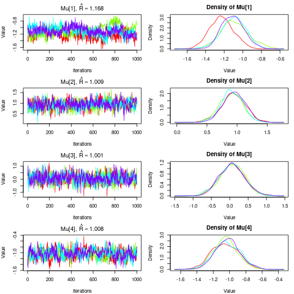
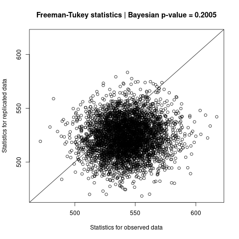

```{r, include = FALSE}
knitr::opts_chunk$set(
  comment = "#>"
)
```

```{r, echo = FALSE, message = FALSE}
library(occumb)
set.seed(1)
```

This section briefly describes the steps involved in the series of model-based analyses of eDNA metabarcoding data using the `occumb` R package.

## Prepare dataset

We will use the package's built-in data `fish` (see `?fish` for documentation) to analyze the sequence count data using the `occumb` package.
The `summary()` function can be used to provide an overview of the dataset.

```{r, eval = FALSE}
data(fish)
summary(fish)
```

```{r}
#> Sequence read counts: 
#>  Number of species, I = 50 
#>  Number of sites, J = 50 
#>  Maximum number of replicates per site, K = 3 
#>  Number of missing observations = 6 
#>  Number of replicates per site: 2.88 (average), 0.33 (sd)
#>  Sequencing depth: 77910 (average), 98034.7 (sd)
#> 
#> Species covariates: 
#>  mismatch (continuous) 
#> Site covariates: 
#>  riverbank (categorical) 
#> Replicate covariates: 
#>  (None) 
#> 
#> Labels for species: 
#>  Abbottina rivularis, Acanthogobius lactipes, Acheilognathus macropterus, Acheilognathus rhombeus, Anguilla japonica, Biwia zezera, Carassius cuvieri, Carassius spp., Channa argus, Ctenopharyngodon idella, Cyprinus carpio, Gambusia affinis, Gnathopogon spp., Gymnogobius castaneus, Gymnogobius petschiliensis, Gymnogobius urotaenia, Hemibarbus spp., Hypomesus nipponensis, Hypophthalmichthys spp., Hyporhamphus intermedius, Ictalurus punctatus, Ischikauia steenackeri, Lepomis macrochirus macrochirus, Leucopsarion petersii, Megalobrama amblycephala, Micropterus dolomieu dolomieu, Micropterus salmoides, Misgurnus spp., Monopterus albus, Mugil cephalus cephalus, Mylopharyngodon piceus, Nipponocypris sieboldii, Nipponocypris temminckii, Opsariichthys platypus, Opsariichthys uncirostris uncirostris, Oryzias latipes, Plecoglossus altivelis altivelis, Pseudogobio spp., Pseudorasbora parva, Rhinogobius spp., Rhodeus ocellatus ocellatus, Salangichthys microdon, Sarcocheilichthys variegatus microoculus, Silurus asotus, Squalidus chankaensis biwae, Tachysurus tokiensis, Tanakia lanceolata, Tribolodon brandtii maruta, Tribolodon hakonensis, Tridentiger spp. 
#> Labels for sites: 
#>  1, 2, 3, 4, 5, 6, 7, 8, 9, 10, 11, 12, 13, 14, 15, 16, 17, 18, 19, 20, 21, 22, 23, 24, 25, 26, 27, 28, 29, 30, 31, 32, 33, 34, 35, 36, 37, 38, 39, 40, 41, 42, 43, 44, 45, 46, 47, 48, 49, 50 
#> Labels for replicates: 
#>  L, C, R 
```

A summary of the sequence read count data can be found in the first block of the output.
Data were obtained from samples taken from 50 sites $\times$ (up to) three replicates, with 50 fish species recorded.
A summary of the missing samples, number of replicates per site, and sequencing depth (i.e., the total number of sequence reads per sample) is also presented.
The second block of the output indicates that the `fish` data also have two covariates: one continuous species covariate, `mismatch`, and one discrete site covariate, `riverbank`, which can be used in the following analysis.
The third block of the output shows the labels assigned to the 50 species, 50 sites, and three replicates.

As such, the `fish` data brought together a set of data relevant to the analysis using the `occumb` package.
When analyzing one's own dataset, you can use `occumbData()` to set up a data object.

If you want to display the entire data, just type `fish`.

```{r, eval = FALSE}
fish # Result not shown
```

## Fit models

Using the `fish` dataset (or the dataset constructed with `occumbData()`), one can fit a multispecies site occupancy model for eDNA metabarcoding using the `occumb()` function which fits the model in a fully Bayesian approach via the Markov Chain Monte Carlo (MCMC) method implemented in [JAGS](https://mcmc-jags.sourceforge.io/).

`occumb()` has several arguments that accept model formulas to fit different model variants using the usual R formula syntax. See `vignette("model_specification")` for an overview of the models that `occumb()` can fit and details on how to specify models.

Fitting a null model (i.e., an intercept-only model, although the value of the intercept is species-specific) is very simple, as follows:

```{r, eval = FALSE}
fit0 <- occumb(data = fish, parallel = TRUE)
```

This model fitting can take approximately one hour. Given that `occumb()` fits a class of complex hierarchical models with many parameters and unknown variables, it may require, depending on the dataset size, a long time and/or a lot of memory for model fitting. Setting `parallel = TRUE` is recommended for faster model fitting through parallel computations.

A model incorporating species and site covariates from the `fish` dataset can be fitted as follows:

```{r, eval = FALSE}
fit1 <- occumb(formula_psi = ~ riverbank,
               formula_phi_shared = ~ mismatch,
               data = fish,
               parallel = TRUE)
```

Here, the `riverbank` is specified as the covariate for site occupancy probability (`psi`) in the `formula_psi` argument, and `mismatch` as the covariate for the relative dominance of sequence (`phi`) in the `formula_phi_shared` argument. In the latter, since `mismatch` is a species covariate, the `formula_phi_shared` argument is used instead of `formula_phi` so that the effect of `mismatch` is constant across species; see `vignette("model_specification")` for more details.

Thus, as in the generalized linear models (GLMs), model parameters can be expressed as functions of covariates, and `occumb()` allows straightforward covariate specification using the formula syntax. We will see later how to examine the estimated parameter values and covariate effects.

`occumb()` also has several arguments for controlling the MCMC computation to fit the model. For example, to obtain more precise posterior estimates than in the above example, one can explicitly set `n.iter` and `n.thin` arguments to obtain longer and less autocorrelated MCMC samples. In the following, `n.iter` and `n.thin` are set to twice the default.

```{r, eval = FALSE}
fit1x <- occumb(formula_psi = ~ riverbank,
                formula_phi_shared = ~ mismatch,
                data = fish,
                n.thin = 20,
                n.iter = 40000,
                parallel = TRUE)
```

Note that when fitting a model using `occumb()`, a warning message `"At least one Rhat value could not be calculated."` may appear. Usually, this warning can be ignored safely. In models fit by `occumb()`, the values of some latent variables may not change across MCMC iterations, making it impossible to compute `Rhat` values for them. This is the correct behavior of the model, but it can cause the above warning to be displayed even when the MCMC method is working properly.


## Check posterior samples

With the `fit1` object, we will examine how to access and diagnose the posterior sample obtained using `occumb()`.

Enter the object name `fit1` to display a summary of the MCMC results, including a table of posterior estimates for each saved parameter.

```{r, eval = FALSE}
fit1 # Result not shown
```

The `plot()` function draws a trace plot and density plot for each parameter.

```{r, eval = FALSE}
plot(fit1) # Outputs many figures; enter "Esc" or "Ctrl + C" to quit
```


Users of the `{jagsUI}` package should be familiar with the outputs of these operations. Model fitting in `occumb()` relies on functions provided by the `{jagsUI}` package, and the above operations apply `print` and `plot` methods to `{jagsUI}` objects.

The `summary()` function provides a high-level summary of the results. This is based on a previous version of the `summary` method for `{jagsUI}` objects (implemented until `{jagsUI}` package version 1.5.2) and is modified for the `occumb()` output, which displays a data summary, model equations, MCMC settings, and a quick overview of the convergence of the relevant model parameters.

```{r, eval = FALSE}
summary(fit1)
```

```{r}
#> Summary for an occumbFit object 
#> 
#> Summary of data:
#>  Number of species, I = 50 
#>  Number of sites, J = 50 
#>  Maximum number of replicates per site, K = 3 
#>  Number of missing observations = 6 
#>  Number of replicates per site: 2.88 (average), 0.33 (sd) 
#>  Sequencing depth: 77910 (average), 98034.7 (sd) 
#> 
#> Model specification:
#>  formula_phi:          ~ 1 
#>  formula_theta:        ~ 1 
#>  formula_psi:          ~ riverbank 
#>  formula_phi_shared:   ~ mismatch 
#>  formula_theta_shared: ~ 1 
#>  formula_psi_shared:   ~ 1 
#>  prior_prec:           1e-04 
#>  prior_ulim:           10000 
#> 
#> Saved parameters:
#>  Mu sigma rho alpha beta gamma alpha_shared phi theta psi z pi deviance 
#> 
#> MCMC ran in parallel for 43.593 minutes at time 2023-09-11 20:16:31.787026:
#>  For each of 4 chains:
#>   Adaptation:            100 iterations (sufficient)
#>   Burn-in:               10000 iterations
#>   Thin rate:             10 iterations
#>   Total chain length:    20100 iterations
#>   Posterior sample size: 1000 draws
#> 
#> Summary of posterior samples: 
#>  Mu: 
#>   Number of parameters: 4 
#>   Rhat:  1.009 (min), 1.027 (median), 1.043 (mean), 1.109 (max) 
#>   n.eff: 30 (min), 117.5 (median), 154.2 (mean), 352 (max) 
#>  sigma: 
#>   Number of parameters: 4 
#>   Rhat:  1.004 (min), 1.04 (median), 1.074 (mean), 1.213 (max) 
#>   n.eff: 17 (min), 67.5 (median), 217 (mean), 716 (max) 
#>  rho: 
#>   Number of parameters: 6 
#>   Rhat:  1.042 (min), 1.107 (median), 1.106 (mean), 1.187 (max) 
#>   n.eff: 19 (min), 33.5 (median), 40.7 (mean), 79 (max) 
#>  alpha: 
#>   Number of parameters: 50 
#>   Rhat:  1.027 (min), 1.093 (median), 1.157 (mean), 1.77 (max) 
#>   n.eff: 7 (min), 34 (median), 40.6 (mean), 104 (max) 
#>  beta: 
#>   Number of parameters: 50 
#>   Rhat:  1.002 (min), 1.018 (median), 1.028 (mean), 1.237 (max) 
#>   n.eff: 16 (min), 183.5 (median), 349.9 (mean), 4000 (max) 
#>  gamma: 
#>   Number of parameters: 100 
#>   Rhat:  1.001 (min), 1.019 (median), 1.029 (mean), 1.136 (max) 
#>   n.eff: 24 (min), 173.5 (median), 363.5 (mean), 2756 (max) 
#>  alpha_shared: 
#>   Number of parameters: 1 
#>   Rhat:  1.1 
#>   n.eff: 31 
#>  phi: 
#>   Number of parameters: 50 
#>   Rhat:  1.001 (min), 1.07 (median), 1.127 (mean), 1.664 (max) 
#>   n.eff: 8 (min), 42.5 (median), 202.7 (mean), 3161 (max) 
#>  theta: 
#>   Number of parameters: 50 
#>   Rhat:  1.002 (min), 1.016 (median), 1.024 (mean), 1.219 (max) 
#>   n.eff: 16 (min), 196 (median), 358.1 (mean), 4000 (max) 
#>  psi: 
#>   Number of parameters: 2500 
#>   Rhat:  1 (min), 1.008 (median), 1.013 (mean), 1.101 (max) 
#>   n.eff: 36 (min), 396 (median), 679.3 (mean), 4000 (max) 
#>  z: 
#>   Number of parameters: 2500 
#>   Rhat:  1 (min), 1.006 (median), 1.009 (mean), 1.184 (max), 946 (Number of NAs) 
#>   n.eff: 1 (min), 1233.5 (median), 1628.6 (mean), 4000 (max) 
#>  pi: 
#>   Number of parameters: 7500 
#>   Rhat:  1 (min), 1.078 (median), 1.102 (mean), 1.294 (max), 30 (Number of NAs) 
#>   n.eff: 1 (min), 1 (median), 1009.1 (mean), 4000 (max) 
#>  deviance: 
#>   Rhat:  1.001 
#>   n.eff: 1332 
```

Convergence of the MCMC algorithm is determined based on the `Rhat` value, which becomes 1 when the chains are converged. Customarily, `Rhat` values of less than 1.1 will be required for the parameters of interest. Overall, the `fit1` model is not very far from convergent, but the convergence of `phi` and `alpha`, the parameters related to the relative dominance of species sequence reads, is not good (i.e., high values of `Rhat`); hence, longer MCMC runs will be required for a formal inference.

The `get_post_samples()` and `get_post_summary()` functions can be used to access the posterior samples of individual parameters or their summaries.
This may require understanding the model parameters and their names: see `vignette("model_specification")` for details.
As an example, we attempt to obtain a posterior summary of the site occupancy probability `psi` using the `get_post_summary()` function.

```{r, eval = FALSE}
post_summary_psi <- get_post_summary(fit1, "psi")
post_summary_psi
```

```{r}
#>                  mean          sd        2.5%        25%        50%        75%      97.5%     Rhat n.eff overlap0 f
#> psi[1,1]   0.64607375 0.083034133 0.466158634 0.59382744 0.65078275 0.70478301 0.79318634 1.001697  1264        0 1
#> psi[2,1]   0.28250539 0.089275014 0.136970706 0.21789079 0.27480943 0.33672122 0.47971573 1.013796   317        0 1
#> psi[3,1]   0.38321762 0.088583160 0.218908875 0.32150169 0.38055944 0.44171514 0.56510758 1.005127   472        0 1
#> psi[4,1]   0.16899696 0.070833671 0.058363836 0.11684541 0.15943020 0.21075828 0.32821669 1.001143  3788        0 1
#> psi[5,1]   0.20435372 0.088327893 0.069729103 0.13950376 0.19315615 0.25286705 0.41681236 1.006308   596        0 1
#> psi[6,1]   0.10737782 0.061179251 0.024299550 0.06246265 0.09573034 0.13925811 0.25577838 1.002291  1418        0 1
#> psi[7,1]   0.84639119 0.053478041 0.730770215 0.81327035 0.85048238 0.88494478 0.93751979 1.003575   654        0 1
#> psi[8,1]   0.94296846 0.028288919 0.875373936 0.92739641 0.94770976 0.96354354 0.98337253 1.002581  1006        0 1
#> (Omitted the remaining)
```

In the `fit1` model, `psi` was assumed to have different values for each site depending on the `riverbank` covariate (remember the `psi_formula` argument for `fit1`). Therefore, `psi` was estimated for each of the 50 species $\times$ 50 sites (note that `psi` differs for each species by default), and the two subscripts in brackets distinguish them. Which species and site parameter was `psi[1,1]` about? How about `psi[2,1]`? Information regarding the dimensions of the parameters is provided in the attributes of the resulting object.

```{r, eval = FALSE}
attributes(post_summary_psi)$dimension
```

```{r}
#> [1] "Species" "Site"
```

```{r, eval = FALSE}
attributes(post_summary_psi)$label
```

```{r}
#> $Species
#>  [1] "Abbottina rivularis"                     
#>  [2] "Acanthogobius lactipes"                  
#>  [3] "Acheilognathus macropterus"              
#>  [4] "Acheilognathus rhombeus"                 
#>  [5] "Anguilla japonica"                       
#>  [6] "Biwia zezera"                            
#>  [7] "Carassius cuvieri"                       
#>  [8] "Carassius spp."                          
#>  [9] "Channa argus"                            
#> [10] "Ctenopharyngodon idella"                 
#> [11] "Cyprinus carpio"                         
#> [12] "Gambusia affinis"                        
#> [13] "Gnathopogon spp."                        
#> [14] "Gymnogobius castaneus"                   
#> [15] "Gymnogobius petschiliensis"              
#> [16] "Gymnogobius urotaenia"                   
#> [17] "Hemibarbus spp."                         
#> [18] "Hypomesus nipponensis"                   
#> [19] "Hypophthalmichthys spp."                 
#> [20] "Hyporhamphus intermedius"                
#> [21] "Ictalurus punctatus"                     
#> [22] "Ischikauia steenackeri"                  
#> [23] "Lepomis macrochirus macrochirus"         
#> [24] "Leucopsarion petersii"                   
#> [25] "Megalobrama amblycephala"                
#> [26] "Micropterus dolomieu dolomieu"           
#> [27] "Micropterus salmoides"                   
#> [28] "Misgurnus spp."                          
#> [29] "Monopterus albus"                        
#> [30] "Mugil cephalus cephalus"                 
#> [31] "Mylopharyngodon piceus"                  
#> [32] "Nipponocypris sieboldii"                 
#> [33] "Nipponocypris temminckii"                
#> [34] "Opsariichthys platypus"                  
#> [35] "Opsariichthys uncirostris uncirostris"   
#> [36] "Oryzias latipes"                         
#> [37] "Plecoglossus altivelis altivelis"        
#> [38] "Pseudogobio spp."                        
#> [39] "Pseudorasbora parva"                     
#> [40] "Rhinogobius spp."                        
#> [41] "Rhodeus ocellatus ocellatus"             
#> [42] "Salangichthys microdon"                  
#> [43] "Sarcocheilichthys variegatus microoculus"
#> [44] "Silurus asotus"                          
#> [45] "Squalidus chankaensis biwae"             
#> [46] "Tachysurus tokiensis"                    
#> [47] "Tanakia lanceolata"                      
#> [48] "Tribolodon brandtii maruta"              
#> [49] "Tribolodon hakonensis"                   
#> [50] "Tridentiger spp."                        
#> 
#> $Site
#>  [1] "1"  "2"  "3"  "4"  "5"  "6"  "7"  "8"  "9"  "10" "11" "12" "13" "14" "15"
#> [16] "16" "17" "18" "19" "20" "21" "22" "23" "24" "25" "26" "27" "28" "29" "30"
#> [31] "31" "32" "33" "34" "35" "36" "37" "38" "39" "40" "41" "42" "43" "44" "45"
#> [46] "46" "47" "48" "49" "50"
```

Thus, from the `$dimension` attribute, one can know that the first subscript of `psi` represents species and the second sites. From the `$label` attribute, one can know that `psi[1,1]` represents the value of `psi` for *Abbottina rivularis* at site 1, and `psi[2,1]` represents the value of `psi` for *Acanthogobius lactipes* at site 1.

Let us also look at the posterior summary of `gamma`, which denotes species-specific effects on `psi`.

```{r, eval = FALSE}
post_summary_gamma <- get_post_summary(fit1, "gamma")
attributes(post_summary_gamma)$dimension
```

```{r}
#> [1] "Species" "Effects"
```

```{r, eval = FALSE}
attributes(post_summary_gamma)$label$Effects
```

```{r}
#> [1] "(Intercept)"                 "riverbankwithout_vegetation"
```

`gamma` had two effect values for each species: the intercept, `(Intercept)`, and the effect of the absence of vegetation on the riverbank, `riverbankwithout_vegetation`. Displaying the summary, one can see that, for many species, the absence of vegetation has a negative effect on `psi` (on its link scale).

```{r, eval = FALSE}
post_summary_gamma
```

```{r}
#>                    mean        sd       2.5%          25%         50%         75%        97.5%      Rhat n.eff overlap0       f
#> (Omitted the beginning)
#> gamma[1,2]  -0.68135951 0.4102181 -1.4106885 -0.964385346 -0.71198673 -0.41908665  0.197784615 1.0031831   720        1 0.93875
#> gamma[2,2]  -0.57124068 0.4861383 -1.4368696 -0.906331725 -0.60645174 -0.27472631  0.480190462 1.0141750   414        1 0.87925
#> gamma[3,2]  -1.07479024 0.4260032 -1.9550037 -1.336688784 -1.07308990 -0.80888005 -0.213626578 1.0040679   632        0 0.99250
#> gamma[4,2]  -0.96563859 0.5007208 -1.9760743 -1.276917710 -0.95208744 -0.64960250  0.016721077 1.0020286  1835        1 0.97225
#> gamma[5,2]  -1.01038376 0.5436033 -2.1340409 -1.339282006 -0.98783592 -0.65193007  0.006887964 1.0148153   190        1 0.97400
#> gamma[6,2]  -0.96443244 0.5694898 -2.1291123 -1.307706597 -0.96394933 -0.62099851  0.205483803 1.0043719   989        1 0.95325
#> gamma[7,2]  -1.44522243 0.4356167 -2.4011743 -1.721131931 -1.39965212 -1.14153735 -0.689367497 1.0021543  1065        0 0.99925
#> gamma[8,2]  -1.36146823 0.4820477 -2.3661876 -1.654265660 -1.32819584 -1.04709249 -0.483307820 1.0014346  1791        0 0.99900
#> (Omitted the remaining)
```

A posterior summary of `Mu`, which denotes the community average of species-specific effects, shows that `riverbankwithout_vegetation` has a community-wide negative effect on `psi` (note from the `label` attribute that `Mu[4]` is the community-level effect of `riverbankwithout_vegetation`).

```{r, eval = FALSE}
get_post_summary(fit1, "Mu")
```

```{r}
#>              mean        sd       2.5%        25%         50%        75%
#> Mu[1] -1.18914419 0.1466486 -1.4845230 -1.2872349 -1.18205680 -1.0888031
#> Mu[2]  0.94327206 0.1945952  0.5640255  0.8102745  0.94803155  1.0691758
#> Mu[3]  0.02522906 0.3264013 -0.6034793 -0.1859071  0.01929096  0.2317505
#> Mu[4] -1.03746412 0.1609537 -1.3626390 -1.1414288 -1.03743346 -0.9292544
#>            97.5%     Rhat n.eff overlap0      f
#> Mu[1] -0.9119219 1.108793    30        0 1.0000
#> Mu[2]  1.3284452 1.031154   100        0 1.0000
#> Mu[3]  0.6951928 1.008576   352        1 0.5255
#> Mu[4] -0.7312586 1.022904   135        0 1.0000
#> attr(,"dimension")
#> [1] "Effects"
#> attr(,"label")
#> attr(,"label")$Effects
#> [1] "phi | (Intercept)"                 "theta | (Intercept)"              
#> [3] "psi | (Intercept)"                 "psi | riverbankwithout_vegetation"
```

Next, let us access the posterior samples rather than their summary using the `get_post_samples()` function. We extract the posterior sample of `psi` from `fit1` as an example.

```{r, eval = FALSE}
post_sample_psi <- get_post_samples(fit1, "psi")
dim(post_sample_psi)
```

```{r}
#> [1] 4000   50   50
```

The resulting object, `post_sample_psi`, is a 3-dimensional array containing the posterior sample of `psi`. Information on the dimensions of the extracted sample is provided in the attributes.

```{r, eval = FALSE}
attributes(post_sample_psi)
```

```{r}
#> $dim
#> [1] 4000   50   50
#> 
#> $dimension
#> [1] "Sample"  "Species" "Site"   
#> 
#> $label
#> $label$Sample
#> NULL
#> 
#> $label$Species
#>  [1] "Abbottina rivularis"                     
#>  [2] "Acanthogobius lactipes"                  
#>  [3] "Acheilognathus macropterus"              
#>  [4] "Acheilognathus rhombeus"                 
#>  [5] "Anguilla japonica"                       
#>  [6] "Biwia zezera"                            
#>  [7] "Carassius cuvieri"                       
#>  [8] "Carassius spp."                          
#>  [9] "Channa argus"                            
#> [10] "Ctenopharyngodon idella"                 
#> [11] "Cyprinus carpio"                         
#> [12] "Gambusia affinis"                        
#> [13] "Gnathopogon spp."                        
#> [14] "Gymnogobius castaneus"                   
#> [15] "Gymnogobius petschiliensis"              
#> [16] "Gymnogobius urotaenia"                   
#> [17] "Hemibarbus spp."                         
#> [18] "Hypomesus nipponensis"                   
#> [19] "Hypophthalmichthys spp."                 
#> [20] "Hyporhamphus intermedius"                
#> [21] "Ictalurus punctatus"                     
#> [22] "Ischikauia steenackeri"                  
#> [23] "Lepomis macrochirus macrochirus"         
#> [24] "Leucopsarion petersii"                   
#> [25] "Megalobrama amblycephala"                
#> [26] "Micropterus dolomieu dolomieu"           
#> [27] "Micropterus salmoides"                   
#> [28] "Misgurnus spp."                          
#> [29] "Monopterus albus"                        
#> [30] "Mugil cephalus cephalus"                 
#> [31] "Mylopharyngodon piceus"                  
#> [32] "Nipponocypris sieboldii"                 
#> [33] "Nipponocypris temminckii"                
#> [34] "Opsariichthys platypus"                  
#> [35] "Opsariichthys uncirostris uncirostris"   
#> [36] "Oryzias latipes"                         
#> [37] "Plecoglossus altivelis altivelis"        
#> [38] "Pseudogobio spp."                        
#> [39] "Pseudorasbora parva"                     
#> [40] "Rhinogobius spp."                        
#> [41] "Rhodeus ocellatus ocellatus"             
#> [42] "Salangichthys microdon"                  
#> [43] "Sarcocheilichthys variegatus microoculus"
#> [44] "Silurus asotus"                          
#> [45] "Squalidus chankaensis biwae"             
#> [46] "Tachysurus tokiensis"                    
#> [47] "Tanakia lanceolata"                      
#> [48] "Tribolodon brandtii maruta"              
#> [49] "Tribolodon hakonensis"                   
#> [50] "Tridentiger spp."                        
#> 
#> $label$Site
#>  [1] "1"  "2"  "3"  "4"  "5"  "6"  "7"  "8"  "9"  "10" "11" "12" "13" "14" "15"
#> [16] "16" "17" "18" "19" "20" "21" "22" "23" "24" "25" "26" "27" "28" "29" "30"
#> [31] "31" "32" "33" "34" "35" "36" "37" "38" "39" "40" "41" "42" "43" "44" "45"
#> [46] "46" "47" "48" "49" "50"
```

Thus, the second dimension of `post_sample_psi` corresponds to species and the third to sites. The labels for species and sites indicate that `post_sample_psi[, 1, 1]` contains the posterior sample of `psi` of *Abbottina rivularis* at site 1.

```{r, eval = FALSE}
post_sample_psi[, 1, 1]
```

```{r}
#>  [1] 0.6673664 0.7505735 0.6416083 0.7011978 0.5935338 0.6087940 0.6159829
#>  [8] 0.7758206 0.6710466 0.7423708 0.6244308 0.6237291 0.6344345 0.6715390
#> [15] 0.6255393 0.7306071 0.6781538 0.7391794 0.6678208 0.6715868 0.7582302
#> [22] 0.5947020 0.4880676 0.6958859 0.6202520 0.5487584 0.6781225 0.7073072
#> (Omitted the remaining)
```


## Predict parameter values

In `occumb()`, three parameters, `psi`, `theta`, and `phi`, can be modeled as a function of covariates (see `vignette("model_specification")` for details). Prediction of these parameters conditional on a given set of covariate values can be easily obtained using the `predict()` function to the fitted object.

The `predict()` function has the `newdata` argument that accepts an optional dataset object used for prediction. If `newdata` is not specified, predictions are made using the fitted covariates; this could be an alternative to the `get_post_summary()` and `get_post_samples()` functions for accessing posterior summaries and posterior samples of parameters. For example, the following will output a 3-dimensional array of the posterior median and upper and lower limits of the 95% credible interval for `psi` of the 50 species and 50 sites.

```{r, eval = FALSE}
predict_psi <- predict(fit1, parameter = "psi", type = "quantiles")
dim(predict_psi)
```

```{r}
#> [1]  3 50 50
```

```{r, eval = FALSE}
attributes(predict_psi)
```

```{r}
#> $dim
#> [1]  3 50 50
#> 
#> $dimnames
#> $dimnames[[1]]
#> [1] "50%"   "2.5%"  "97.5%"
#> 
#> $dimnames[[2]]
#> NULL
#> 
#> $dimnames[[3]]
#> NULL
#> 
#> 
#> $parameter
#> [1] "psi"
#> 
#> $scale
#> [1] "response"
#> 
#> $dimension
#> [1] "Statistics" "Species"    "Sites"     
#> 
#> $label
#> $label$Statistics
#> [1] "50%"   "2.5%"  "97.5%"
#> 
#> $label$Species
#>  [1] "Abbottina rivularis"                     
#>  [2] "Acanthogobius lactipes"                  
#>  [3] "Acheilognathus macropterus"              
#>  [4] "Acheilognathus rhombeus"                 
#>  [5] "Anguilla japonica"                       
#>  [6] "Biwia zezera"                            
#>  [7] "Carassius cuvieri"                       
#>  [8] "Carassius spp."                          
#>  [9] "Channa argus"                            
#> [10] "Ctenopharyngodon idella"                 
#> [11] "Cyprinus carpio"                         
#> [12] "Gambusia affinis"                        
#> [13] "Gnathopogon spp."                        
#> [14] "Gymnogobius castaneus"                   
#> [15] "Gymnogobius petschiliensis"              
#> [16] "Gymnogobius urotaenia"                   
#> [17] "Hemibarbus spp."                         
#> [18] "Hypomesus nipponensis"                   
#> [19] "Hypophthalmichthys spp."                 
#> [20] "Hyporhamphus intermedius"                
#> [21] "Ictalurus punctatus"                     
#> [22] "Ischikauia steenackeri"                  
#> [23] "Lepomis macrochirus macrochirus"         
#> [24] "Leucopsarion petersii"                   
#> [25] "Megalobrama amblycephala"                
#> [26] "Micropterus dolomieu dolomieu"           
#> [27] "Micropterus salmoides"                   
#> [28] "Misgurnus spp."                          
#> [29] "Monopterus albus"                        
#> [30] "Mugil cephalus cephalus"                 
#> [31] "Mylopharyngodon piceus"                  
#> [32] "Nipponocypris sieboldii"                 
#> [33] "Nipponocypris temminckii"                
#> [34] "Opsariichthys platypus"                  
#> [35] "Opsariichthys uncirostris uncirostris"   
#> [36] "Oryzias latipes"                         
#> [37] "Plecoglossus altivelis altivelis"        
#> [38] "Pseudogobio spp."                        
#> [39] "Pseudorasbora parva"                     
#> [40] "Rhinogobius spp."                        
#> [41] "Rhodeus ocellatus ocellatus"             
#> [42] "Salangichthys microdon"                  
#> [43] "Sarcocheilichthys variegatus microoculus"
#> [44] "Silurus asotus"                          
#> [45] "Squalidus chankaensis biwae"             
#> [46] "Tachysurus tokiensis"                    
#> [47] "Tanakia lanceolata"                      
#> [48] "Tribolodon brandtii maruta"              
#> [49] "Tribolodon hakonensis"                   
#> [50] "Tridentiger spp."                        
#> 
#> $label$Sites
#>  [1] "1"  "2"  "3"  "4"  "5"  "6"  "7"  "8"  "9"  "10" "11" "12" "13" "14" "15"
#> [16] "16" "17" "18" "19" "20" "21" "22" "23" "24" "25" "26" "27" "28" "29" "30"
#> [31] "31" "32" "33" "34" "35" "36" "37" "38" "39" "40" "41" "42" "43" "44" "45"
#> [46] "46" "47" "48" "49" "50"
```

One can obtain posterior samples of `psi` with the `predict()` function by specifying `type = "samples"` instead of `type = "quantiles"`.

For an example of specifying the `newdata` argument, let us prepare a new dataset containing two sites with different `riverbank` values. Recall that in `fit1`, `psi` was expressed as a function of the site covariate `riverbank`. Here, we use the new dataset created below to predict `psi` of two sites with different `riverbank` values. In the following, `fish_raw` is a data object built into the package that stores the same data as `fish` in the list format (see `?fish_raw` for documentation).

```{r, eval = FALSE}
new_y <- array(1, dim = c(50, 2, 1))
new_riverbank <- factor(levels(fish_raw$riverbank))
dimnames(new_y)[[1]] <- dimnames(fish_raw$y)[[1]]
dimnames(new_y)[[2]] <- levels(fish_raw$riverbank)
newdata <- occumbData(y = new_y,
                      spec_cov = list(mismatch = fish_raw$mismatch),
                      site_cov = list(riverbank = new_riverbank))
```

Covariate values are relevant to the prediction but not the sequence read counts. Hence, any hypothetical data may be given to the sequence read count data, `y`, which was set to an array with elements of 1, `new_y`, here. Let's verify that `newdata` is a dataset with `I = 50` species, `J = 2` sites, and `K = 1` replicate, including `mismatch` and `riverbank` as covariates. Note that the first site is labeled (for demonstration purposes) as a site with vegetation (`with_vegetation`) and the second site as a site without vegetation (`without_vegetation`).

```{r, eval = FALSE}
summary(newdata)
```

```{r}
#> Sequence read counts: 
#>  Number of species, I = 50 
#>  Number of sites, J = 2 
#>  Maximum number of replicates per site, K = 1 
#>  Number of missing observations = 0 
#>  Number of replicates per site: 1 (average), 0 (sd) 
#>  Sequencing depth: 50 (average), 0 (sd) 
#> 
#> Species covariates: 
#>  mismatch (continuous) 
#> Site covariates: 
#>  riverbank (categorical) 
#> Replicate covariates: 
#>  (None) 
#> 
#> Labels for species: 
#>  Abbottina rivularis, Acanthogobius lactipes, Acheilognathus macropterus, Acheilognathus rhombeus, Anguilla japonica, Biwia zezera, Carassius cuvieri, Carassius spp., Channa argus, Ctenopharyngodon idella, Cyprinus carpio, Gambusia affinis, Gnathopogon spp., Gymnogobius castaneus, Gymnogobius petschiliensis, Gymnogobius urotaenia, Hemibarbus spp., Hypomesus nipponensis, Hypophthalmichthys spp., Hyporhamphus intermedius, Ictalurus punctatus, Ischikauia steenackeri, Lepomis macrochirus macrochirus, Leucopsarion petersii, Megalobrama amblycephala, Micropterus dolomieu dolomieu, Micropterus salmoides, Misgurnus spp., Monopterus albus, Mugil cephalus cephalus, Mylopharyngodon piceus, Nipponocypris sieboldii, Nipponocypris temminckii, Opsariichthys platypus, Opsariichthys uncirostris uncirostris, Oryzias latipes, Plecoglossus altivelis altivelis, Pseudogobio spp., Pseudorasbora parva, Rhinogobius spp., Rhodeus ocellatus ocellatus, Salangichthys microdon, Sarcocheilichthys variegatus microoculus, Silurus asotus, Squalidus chankaensis biwae, Tachysurus tokiensis, Tanakia lanceolata, Tribolodon brandtii maruta, Tribolodon hakonensis, Tridentiger spp. 
#> Labels for sites: 
#>  with_vegetation, without_vegetation 
#> Labels for replicates: 
#>  (None) 
```

When the `predict()` function is applied with the `newdata` argument, predictions are made using the covariate values contained in the `newdata`. The following will provide a prediction of `psi` for each of the sites with and without vegetation.

```{r, eval = FALSE}
predict(fit1, newdata = newdata, parameter = "psi", type = "quantiles")
```

```{r}
#> , , 1
#> 
#>            [,1]      [,2]      [,3]       [,4]       [,5]       [,6]      [,7]
#> 50%   0.6615133 0.2751231 0.3827295 0.15224665 0.17718177 0.09182312 0.8490621
#> 2.5%  0.4802434 0.1300821 0.2306797 0.05507663 0.06783645 0.02441254 0.7212899
#> 97.5% 0.7915599 0.4723714 0.5649520 0.32693805 0.38346795 0.24695832 0.9368627
#>            [,8]      [,9]     [,10]     [,11]      [,12]     [,13]      [,14]
#> 50%   0.9491461 0.6094722 0.4620570 0.9901477 0.08998769 0.8800989 0.15458012
#> 2.5%  0.8789348 0.4101236 0.2996333 0.9557121 0.02421783 0.7735010 0.05625485
#> 97.5% 0.9844834 0.8144525 0.6430711 0.9986149 0.23751947 0.9596028 0.31844988
#>            [,15]     [,16]     [,17]      [,18]     [,19]     [,20]     [,21]
#> 50%   0.12125019 0.9695970 0.9028737 0.15509196 0.5713331 0.2300419 0.8826944
#> 2.5%  0.03724413 0.9110775 0.8015870 0.05106154 0.3814354 0.1092197 0.7664569
#> 97.5% 0.26923379 0.9924366 0.9631803 0.34754250 0.7741282 0.4051336 0.9550034
#>           [,22]     [,23]      [,24]      [,25]      [,26]     [,27]     [,28]
#> 50%   0.7916404 0.7469745 0.06964821 0.15088247 0.10296476 0.8278437 0.9750893
#> 2.5%  0.6445037 0.5788305 0.01384897 0.04985234 0.02831969 0.7060083 0.9284540
#> 97.5% 0.9020019 0.8627692 0.19692563 0.34110667 0.25821933 0.9216507 0.9943395
#>            [,29]     [,30]      [,31]     [,32]     [,33]     [,34]     [,35]
#> 50%   0.06220973 0.4863689 0.07515230 0.4353972 0.2299977 0.8332137 0.5024979
#> 2.5%  0.01098996 0.2994199 0.01757379 0.2667359 0.1056246 0.6977411 0.3344813
#> 97.5% 0.19309849 0.6536841 0.21486234 0.6188191 0.4107509 0.9326166 0.6992168
#>           [,36]      [,37]     [,38]     [,39]     [,40]     [,41]      [,42]
#> 50%   0.5793313 0.09849281 0.5462387 0.9190994 0.9970209 0.8173368 0.09874564
#> 2.5%  0.4008518 0.02705771 0.3669093 0.8250025 0.9815437 0.6718077 0.02554623
#> 97.5% 0.7541354 0.25569027 0.7265439 0.9755158 0.9997452 0.9114977 0.26906733
#>            [,43]     [,44]     [,45]     [,46]      [,47]     [,48]     [,49]
#> 50%   0.15160773 0.5472967 0.3177699 0.1336518 0.16453410 0.3119199 0.1010661
#> 2.5%  0.05407187 0.3702903 0.1750710 0.0401887 0.06069858 0.1646373 0.0270361
#> 97.5% 0.32445164 0.7429405 0.4983112 0.3168030 0.32694679 0.4919569 0.2257502
#>           [,50]
#> 50%   0.9885246
#> 2.5%  0.9521853
#> 97.5% 0.9984315
#> 
#> , , 2
#> 
#>            [,1]       [,2]       [,3]       [,4]       [,5]       [,6]
#> 50%   0.4756873 0.16831019 0.17344502 0.06827157 0.08065680 0.03799725
#> 2.5%  0.3210251 0.07468112 0.08268459 0.02152790 0.02558621 0.00904520
#> 97.5% 0.6477671 0.31803370 0.30375314 0.16653407 0.20628815 0.10914663
#>            [,7]      [,8]      [,9]     [,10]     [,11]      [,12]     [,13]
#> 50%   0.5747380 0.8277408 0.4451700 0.2415741 0.9426904 0.04637033 0.6435848
#> 2.5%  0.4085796 0.6832309 0.2727587 0.1336498 0.8361653 0.01254011 0.4719155
#> 97.5% 0.7316505 0.9241055 0.6653103 0.3976390 0.9855532 0.12900086 0.7834428
#>            [,14]      [,15]     [,16]     [,17]      [,18]     [,19]     [,20]
#> 50%   0.07037047 0.06163691 0.8602899 0.6909106 0.08289891 0.3366483 0.1156426
#> 2.5%  0.02364689 0.01866216 0.7192849 0.5273816 0.02726444 0.2012909 0.0498471
#> 97.5% 0.16850684 0.15171748 0.9468762 0.8219908 0.20203910 0.5227359 0.2284146
#>           [,21]     [,22]     [,23]       [,24]      [,25]      [,26]     [,27]
#> 50%   0.7204299 0.5831452 0.5653456 0.030925710 0.06781351 0.05881219 0.6000844
#> 2.5%  0.5574411 0.4218203 0.4080076 0.006236538 0.02063876 0.01733949 0.4410841
#> 97.5% 0.8503492 0.7422631 0.7276702 0.094870829 0.17049638 0.16207666 0.7470483
#>           [,28]       [,29]     [,30]      [,31]      [,32]      [,33]
#> 50%   0.9126102 0.035225441 0.3407391 0.04236923 0.16616006 0.08886842
#> 2.5%  0.8020100 0.007672009 0.2031182 0.01018349 0.07272355 0.03188771
#> 97.5% 0.9696633 0.110552419 0.5178231 0.13816851 0.29161845 0.18440940
#>           [,34]     [,35]     [,36]      [,37]     [,38]     [,39]     [,40]
#> 50%   0.5159626 0.2344728 0.3705463 0.04820736 0.2161039 0.7693729 0.9831972
#> 2.5%  0.3512136 0.1224432 0.2295261 0.01206818 0.1039605 0.6147098 0.9306534
#> 97.5% 0.6751210 0.3846941 0.5527593 0.13468654 0.3594184 0.8923270 0.9976299
#>           [,41]      [,42]      [,43]     [,44]      [,45]      [,46]
#> 50%   0.6527351 0.06006526 0.06753850 0.2371226 0.15535572 0.05145973
#> 2.5%  0.4967540 0.01537025 0.02157825 0.1134572 0.07282467 0.01382803
#> 97.5% 0.7956659 0.16542028 0.16515022 0.3848913 0.27405126 0.13368309
#>            [,47]      [,48]      [,49]     [,50]
#> 50%   0.08990812 0.13653424 0.05038579 0.9428926
#> 2.5%  0.03330197 0.05777936 0.01466287 0.8401821
#> 97.5% 0.20500919 0.25327092 0.12890174 0.9873862
#> 
#> attr(,"parameter")
#> [1] "psi"
#> attr(,"scale")
#> [1] "response"
#> attr(,"dimension")
#> [1] "Statistics" "Species"    "Sites"     
#> attr(,"label")
#> attr(,"label")$Statistics
#> [1] "50%"   "2.5%"  "97.5%"
#> 
#> attr(,"label")$Species
#>  [1] "Abbottina rivularis"                     
#>  [2] "Acanthogobius lactipes"                  
#>  [3] "Acheilognathus macropterus"              
#>  [4] "Acheilognathus rhombeus"                 
#>  [5] "Anguilla japonica"                       
#>  [6] "Biwia zezera"                            
#>  [7] "Carassius cuvieri"                       
#>  [8] "Carassius spp."                          
#>  [9] "Channa argus"                            
#> [10] "Ctenopharyngodon idella"                 
#> [11] "Cyprinus carpio"                         
#> [12] "Gambusia affinis"                        
#> [13] "Gnathopogon spp."                        
#> [14] "Gymnogobius castaneus"                   
#> [15] "Gymnogobius petschiliensis"              
#> [16] "Gymnogobius urotaenia"                   
#> [17] "Hemibarbus spp."                         
#> [18] "Hypomesus nipponensis"                   
#> [19] "Hypophthalmichthys spp."                 
#> [20] "Hyporhamphus intermedius"                
#> [21] "Ictalurus punctatus"                     
#> [22] "Ischikauia steenackeri"                  
#> [23] "Lepomis macrochirus macrochirus"         
#> [24] "Leucopsarion petersii"                   
#> [25] "Megalobrama amblycephala"                
#> [26] "Micropterus dolomieu dolomieu"           
#> [27] "Micropterus salmoides"                   
#> [28] "Misgurnus spp."                          
#> [29] "Monopterus albus"                        
#> [30] "Mugil cephalus cephalus"                 
#> [31] "Mylopharyngodon piceus"                  
#> [32] "Nipponocypris sieboldii"                 
#> [33] "Nipponocypris temminckii"                
#> [34] "Opsariichthys platypus"                  
#> [35] "Opsariichthys uncirostris uncirostris"   
#> [36] "Oryzias latipes"                         
#> [37] "Plecoglossus altivelis altivelis"        
#> [38] "Pseudogobio spp."                        
#> [39] "Pseudorasbora parva"                     
#> [40] "Rhinogobius spp."                        
#> [41] "Rhodeus ocellatus ocellatus"             
#> [42] "Salangichthys microdon"                  
#> [43] "Sarcocheilichthys variegatus microoculus"
#> [44] "Silurus asotus"                          
#> [45] "Squalidus chankaensis biwae"             
#> [46] "Tachysurus tokiensis"                    
#> [47] "Tanakia lanceolata"                      
#> [48] "Tribolodon brandtii maruta"              
#> [49] "Tribolodon hakonensis"                   
#> [50] "Tridentiger spp."                        
#> 
#> attr(,"label")$Sites
#> [1] "with_vegetation"    "without_vegetation"
```

## Assess goodness-of-fit

Assessing the goodness-of-fit of a model is an essential step in data analysis based on statistical models. The goodness-of-fit of the models fitted with `occumb()` is evaluated using the `gof()` function, which computes the Bayesian p-value using the posterior predictive check approach. The Bayesian p-value may take extreme values (e.g., `p < 0.05` or `p > 0.95`) when the model was poorly fitted.

```{r, eval = FALSE}
gof_result <- gof(fit1, cores = 4)
```

For faster computation, it is recommended that the `cores` argument be specified explicitly for parallel computations. By default, the `gof()` function outputs a scatter plot of fit statistics (in this case, the default Freeman-Tukey statistics).

Enter the name of the resulting object to summarize the results.

```{r, eval = FALSE}
gof_result
```

```{r}
#> Posterior predictive check for an occumbFit object:
#>  Statistics: Freeman-Tukey 
#>  p-value:    0.2005 
#>  Discrepancy statistics for observed data:   542.81 (mean), 17.92 (sd) 
#>  Discrepancy statistics for replicated data: 523.28 (mean), 16.47 (sd) 
```

A moderate p-value indicated a lack of evidence of the model's inadequacy in fitting.

The `plot()` function can be used to (re)draw a scatter plot of the fit statistics for the resulting object.

```{r, eval = FALSE}
plot(gof_result)
```


## Analyze study design

The model fitted with `occumb()` can be used to identify eDNA metabarcoding study designs that can effectively detect the species present. How many sites, within-site replicates, and sequencing depths are required for reliable species detection? What is the best balance between the number of sites visited, number of within-site replicates, and sequencing depth under a limited budget? The multispecies site occupancy model fit by `occumb()` answers these questions by predicting the number of species expected to be detected using specific study designs.

`eval_util_L()` and `eval_util_R()` are functions available for these purposes. These two functions assume species diversity assessments at different spatial scales (i.e., the former is for local (L) and the latter for regional (R)). Specifically, `eval_util_L()` is appropriate if you are interested in assessing species diversity only for the study sites included in the dataset, and `eval_util_R()` is appropriate if you are interested in assessing species diversity in a broader area that includes the study sites in the dataset (i.e., the population of sites or a "metacommunity").

In the context of the `fish` dataset, `eval_util_L()` evaluates the expected number of species detected per site at 50 sites in the dataset under different combinations of number of replicates and sequencing depth. For example, the following will give the expected number of species detected per site (referred to as `Utility` below) when the number of replicates `K` and the sequencing depth `N` take the values (1, 2, 3) and (1000, 10000, 100000), respectively.

```{r, eval = FALSE}
utilL1 <- eval_util_L(expand.grid(K = 1:3, N = c(1E3, 1E4, 1E5)),
                      fit1, cores = 4)
utilL1
```

```{r}
#>   K     N  Utility
#> 1 1 1e+03 13.03225
#> 2 2 1e+03 16.72177
#> 3 3 1e+03 18.21783
#> 4 1 1e+04 14.34826
#> 5 2 1e+04 17.72304
#> 6 3 1e+04 18.92009
#> 7 1 1e+05 15.04591
#> 8 2 1e+05 18.20935
#> 9 3 1e+05 19.23478
```

It can be seen that as `K` and `N` increase, the `Utility` value increases. For faster computation, it is recommended that the `cores` argument be explicitly specified for parallel computation.

If one knows the cost per sequence read for high-throughput sequencing, cost per replicate for library preparation, and research budget values, the `list_cond_L()` function can be used to obtain a set of feasible settings under these cost and budget values. This can be applied to `eval_util_L()` to identify the optimal study design under the budget constraints.

```{r, eval = FALSE}
settings <- list_cond_L(budget = 875 * 1E3,
                        lambda1 = 0.01,
                        lambda2 = 5000,
                        fit1)
utilL2 <- eval_util_L(settings, fit1, cores = 4)
utilL2
```

```{r}
#>   budget lambda1 lambda2 K          N  Utility
#> 1 875000    0.01    5000 1 1250000.00 15.45671
#> 2 875000    0.01    5000 2  375000.00 18.37862
#> 3 875000    0.01    5000 3   83333.33 19.21953
```

Hence, under this specific budget and cost, it is best to have `K = 3` replicates per site for effective species detection.

In contrast to `eval_util_L()`, `eval_util_R()` considers differences in the number of sites visited. Nevertheless, `eval_util_R()` can be applied similarly as `eval_util_L()`. 
In `eval_util_R()`, `Utility` is the number of species expected to be detected in the region of interest under the settings of number of sites `J`, number of replicates `K`, and sequencing depth `N`.
Because `list_cond_R()` may return a large list of possible settings, one may want to obtain a manually restricted list using its `J` and/or `K` arguments.


```{r, eval = FALSE}
utilR1 <- eval_util_R(expand.grid(J = 1:3, K = 1:3, N = c(1E3, 1E4, 1E5)),
                      fit1, cores = 4)
utilR1
```

```{r}
#> 1  1 1 1e+03 13.06227
#> 2  2 1 1e+03 18.77537
#> 3  3 1 1e+03 22.21901
#> 4  1 2 1e+03 16.75208
#> 5  2 2 1e+03 22.80510
#> 6  3 2 1e+03 26.33776
#> 7  1 3 1e+03 18.18526
#> 8  2 3 1e+03 24.63089
#> 9  3 3 1e+03 28.13433
#> 10 1 1 1e+04 14.36287
#> 11 2 1 1e+04 20.30642
#> 12 3 1 1e+04 23.85725
#> 13 1 2 1e+04 17.65318
#> 14 2 2 1e+04 23.98433
#> 15 3 2 1e+04 27.55905
#> 16 1 3 1e+04 19.03370
#> 17 2 3 1e+04 25.30884
#> 18 3 3 1e+04 29.14037
#> 19 1 1 1e+05 14.97290
#> 20 2 1 1e+05 21.16216
#> 21 3 1 1e+05 24.76543
#> 22 1 2 1e+05 18.25193
#> 23 2 2 1e+05 24.64478
#> 24 3 2 1e+05 28.20150
#> 25 1 3 1e+05 19.33757
#> 26 2 3 1e+05 25.85813
#> 27 3 3 1e+05 29.68874
```

```{r, eval = FALSE}
settings <- list_cond_R(budget = 1125 * 1E3,
                        lambda1 = 0.01,
                        lambda2 = 5000,
                        lambda3 = 5000,
                        J = seq(5, 50, 5),
                        K = 1:4)
utilR2 <- eval_util_R(settings, fit1, cores = 4)
utilR2
```

```{r}
#>     budget lambda1 lambda2 lambda3  J K           N  Utility
#> 1  1125000    0.01    5000    5000  5 1 21500000.00 30.04136
#> 2  1125000    0.01    5000    5000 10 1 10250000.00 35.64544
#> 3  1125000    0.01    5000    5000 15 1  6500000.00 38.60797
#> 4  1125000    0.01    5000    5000 20 1  4625000.00 40.60944
#> 5  1125000    0.01    5000    5000 25 1  3500000.00 42.02112
#> 6  1125000    0.01    5000    5000 30 1  2750000.00 43.15096
#> 7  1125000    0.01    5000    5000 35 1  2214285.71 43.89833
#> 8  1125000    0.01    5000    5000 40 1  1812500.00 44.71556
#> 9  1125000    0.01    5000    5000 45 1  1500000.00 45.22666
#> 10 1125000    0.01    5000    5000 50 1  1250000.00 45.71167
#> 11 1125000    0.01    5000    5000  5 2 10500000.00 33.34409
#> 12 1125000    0.01    5000    5000 10 2  4875000.00 38.81906
#> 13 1125000    0.01    5000    5000 15 2  3000000.00 41.58322
#> 14 1125000    0.01    5000    5000 20 2  2062500.00 43.47530
#> 15 1125000    0.01    5000    5000 25 2  1500000.00 44.69525
#> 16 1125000    0.01    5000    5000 30 2  1125000.00 45.58398
#> 17 1125000    0.01    5000    5000 35 2   857142.86 46.27036
#> 18 1125000    0.01    5000    5000 40 2   656250.00 46.82490
#> 19 1125000    0.01    5000    5000 45 2   500000.00 47.24841
#> 20 1125000    0.01    5000    5000 50 2   375000.00 47.56585
#> 21 1125000    0.01    5000    5000  5 3  6833333.33 34.55557
#> 22 1125000    0.01    5000    5000 10 3  3083333.33 40.03808
#> 23 1125000    0.01    5000    5000 15 3  1833333.33 42.85560
#> 24 1125000    0.01    5000    5000 20 3  1208333.33 44.51759
#> 25 1125000    0.01    5000    5000 25 3   833333.33 45.67757
#> 26 1125000    0.01    5000    5000 30 3   583333.33 46.48685
#> 27 1125000    0.01    5000    5000 35 3   404761.90 47.14072
#> 28 1125000    0.01    5000    5000 40 3   270833.33 47.60570
#> 29 1125000    0.01    5000    5000 45 3   166666.67 47.93433
#> 30 1125000    0.01    5000    5000 50 3    83333.33 48.12801
#> 31 1125000    0.01    5000    5000  5 4  5000000.00 35.17767
#> 32 1125000    0.01    5000    5000 10 4  2187500.00 40.72769
#> 33 1125000    0.01    5000    5000 15 4  1250000.00 43.51095
#> 34 1125000    0.01    5000    5000 20 4   781250.00 45.16898
#> 35 1125000    0.01    5000    5000 25 4   500000.00 46.23139
#> 36 1125000    0.01    5000    5000 30 4   312500.00 46.98586
#> 37 1125000    0.01    5000    5000 35 4   178571.43 47.53393
#> 38 1125000    0.01    5000    5000 40 4    78125.00 47.89744
```

